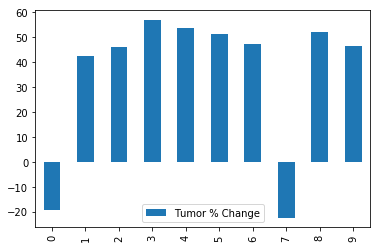

# Pymaceuticals Inc.

## Analysis

* Mice that undewent treatment with Capomulin had the highest reduction of tumor volume and highest amount of survival rate.
* Regardless of the 4 observed treatments, the numbers of metastatic sites increased with treatment duration with the placebo having the highest increase and Capomulin the lowest.
* Certain mice, as in those treated with Ketapril and Infubinol, experienced accelerated tumor growth alongside the placebo, along with increase metatstatic sites which led to less than 45% survival rate after 45 day treatment.


```python
import pandas as pd
import matplotlib.pyplot as plt
import numpy as np
import seaborn as sns
```


```python
file_1 = "Resources/clinicaltrial_data.csv"
file_2 = "Resources/mouse_drug_data.csv"

_trial = pd.read_csv(file_1)
_drug_data = pd.read_csv(file_2)
```


```python
_data = pd.merge(_trial, _drug_data, how='left', on='Mouse ID').drop_duplicates()
_data.head()
```


<div>
<style>
    .dataframe thead tr:only-child th {
        text-align: right;
    }

    .dataframe thead th {
        text-align: left;
    }

    .dataframe tbody tr th {
        vertical-align: top;
    }
</style>
<table border="1" class="dataframe">
  <thead>
    <tr style="text-align: right;">
      <th></th>
      <th>Mouse ID</th>
      <th>Timepoint</th>
      <th>Tumor Volume (mm3)</th>
      <th>Metastatic Sites</th>
      <th>Drug</th>
    </tr>
  </thead>
  <tbody>
    <tr>
      <th>0</th>
      <td>b128</td>
      <td>0</td>
      <td>45.0</td>
      <td>0</td>
      <td>Capomulin</td>
    </tr>
    <tr>
      <th>1</th>
      <td>f932</td>
      <td>0</td>
      <td>45.0</td>
      <td>0</td>
      <td>Ketapril</td>
    </tr>
    <tr>
      <th>2</th>
      <td>g107</td>
      <td>0</td>
      <td>45.0</td>
      <td>0</td>
      <td>Ketapril</td>
    </tr>
    <tr>
      <th>3</th>
      <td>a457</td>
      <td>0</td>
      <td>45.0</td>
      <td>0</td>
      <td>Ketapril</td>
    </tr>
    <tr>
      <th>4</th>
      <td>c819</td>
      <td>0</td>
      <td>45.0</td>
      <td>0</td>
      <td>Ketapril</td>
    </tr>
  </tbody>
</table>
</div>


```python
_data.count()
```


    Mouse ID              1904
    Timepoint             1904
    Tumor Volume (mm3)    1904
    Metastatic Sites      1904
    Drug                  1904
    dtype: int64


## Tumor Response To Treatment


```python
drug_data = _data.set_index(['Drug', 'Timepoint'])
average_vol = pd.DataFrame(drug_data.groupby(['Drug', 'Timepoint'])['Tumor Volume (mm3)'].mean())
average_vol
```


<div>
<style>
    .dataframe thead tr:only-child th {
        text-align: right;
    }

    .dataframe thead th {
        text-align: left;
    }

    .dataframe tbody tr th {
        vertical-align: top;
    }
</style>
<table border="1" class="dataframe">
  <thead>
    <tr style="text-align: right;">
      <th></th>
      <th></th>
      <th>Tumor Volume (mm3)</th>
    </tr>
    <tr>
      <th>Drug</th>
      <th>Timepoint</th>
      <th></th>
    </tr>
  </thead>
  <tbody>
    <tr>
      <th rowspan="10" valign="top">Capomulin</th>
      <th>0</th>
      <td>45.000000</td>
    </tr>
    <tr>
      <th>5</th>
      <td>44.266086</td>
    </tr>
    <tr>
      <th>10</th>
      <td>43.084291</td>
    </tr>
    <tr>
      <th>15</th>
      <td>42.064317</td>
    </tr>
    <tr>
      <th>20</th>
      <td>40.716325</td>
    </tr>
    <tr>
      <th>25</th>
      <td>39.939528</td>
    </tr>
    <tr>
      <th>30</th>
      <td>38.769339</td>
    </tr>
    <tr>
      <th>35</th>
      <td>37.816839</td>
    </tr>
    <tr>
      <th>40</th>
      <td>36.958001</td>
    </tr>
    <tr>
      <th>45</th>
      <td>36.236114</td>
    </tr>
    <tr>
      <th rowspan="10" valign="top">Ceftamin</th>
      <th>0</th>
      <td>45.000000</td>
    </tr>
    <tr>
      <th>5</th>
      <td>46.503051</td>
    </tr>
    <tr>
      <th>10</th>
      <td>48.285125</td>
    </tr>
    <tr>
      <th>15</th>
      <td>50.094055</td>
    </tr>
    <tr>
      <th>20</th>
      <td>52.157049</td>
    </tr>
    <tr>
      <th>25</th>
      <td>54.287674</td>
    </tr>
    <tr>
      <th>30</th>
      <td>56.769517</td>
    </tr>
    <tr>
      <th>35</th>
      <td>58.827548</td>
    </tr>
    <tr>
      <th>40</th>
      <td>61.467895</td>
    </tr>
    <tr>
      <th>45</th>
      <td>64.132421</td>
    </tr>
    <tr>
      <th rowspan="10" valign="top">Infubinol</th>
      <th>0</th>
      <td>45.000000</td>
    </tr>
    <tr>
      <th>5</th>
      <td>47.062001</td>
    </tr>
    <tr>
      <th>10</th>
      <td>49.403909</td>
    </tr>
    <tr>
      <th>15</th>
      <td>51.296397</td>
    </tr>
    <tr>
      <th>20</th>
      <td>53.197691</td>
    </tr>
    <tr>
      <th>25</th>
      <td>55.715252</td>
    </tr>
    <tr>
      <th>30</th>
      <td>58.299397</td>
    </tr>
    <tr>
      <th>35</th>
      <td>60.742461</td>
    </tr>
    <tr>
      <th>40</th>
      <td>63.162824</td>
    </tr>
    <tr>
      <th>45</th>
      <td>65.755562</td>
    </tr>
    <tr>
      <th>...</th>
      <th>...</th>
      <td>...</td>
    </tr>
    <tr>
      <th rowspan="10" valign="top">Ramicane</th>
      <th>0</th>
      <td>45.000000</td>
    </tr>
    <tr>
      <th>5</th>
      <td>43.944859</td>
    </tr>
    <tr>
      <th>10</th>
      <td>42.531957</td>
    </tr>
    <tr>
      <th>15</th>
      <td>41.495061</td>
    </tr>
    <tr>
      <th>20</th>
      <td>40.238325</td>
    </tr>
    <tr>
      <th>25</th>
      <td>38.974300</td>
    </tr>
    <tr>
      <th>30</th>
      <td>38.703137</td>
    </tr>
    <tr>
      <th>35</th>
      <td>37.451996</td>
    </tr>
    <tr>
      <th>40</th>
      <td>36.574081</td>
    </tr>
    <tr>
      <th>45</th>
      <td>34.955595</td>
    </tr>
    <tr>
      <th rowspan="10" valign="top">Stelasyn</th>
      <th>0</th>
      <td>45.000000</td>
    </tr>
    <tr>
      <th>5</th>
      <td>47.527452</td>
    </tr>
    <tr>
      <th>10</th>
      <td>49.463844</td>
    </tr>
    <tr>
      <th>15</th>
      <td>51.529409</td>
    </tr>
    <tr>
      <th>20</th>
      <td>54.067395</td>
    </tr>
    <tr>
      <th>25</th>
      <td>56.166123</td>
    </tr>
    <tr>
      <th>30</th>
      <td>59.826738</td>
    </tr>
    <tr>
      <th>35</th>
      <td>62.440699</td>
    </tr>
    <tr>
      <th>40</th>
      <td>65.356386</td>
    </tr>
    <tr>
      <th>45</th>
      <td>68.438310</td>
    </tr>
    <tr>
      <th rowspan="10" valign="top">Zoniferol</th>
      <th>0</th>
      <td>45.000000</td>
    </tr>
    <tr>
      <th>5</th>
      <td>46.851818</td>
    </tr>
    <tr>
      <th>10</th>
      <td>48.689881</td>
    </tr>
    <tr>
      <th>15</th>
      <td>50.779059</td>
    </tr>
    <tr>
      <th>20</th>
      <td>53.170334</td>
    </tr>
    <tr>
      <th>25</th>
      <td>55.432935</td>
    </tr>
    <tr>
      <th>30</th>
      <td>57.713531</td>
    </tr>
    <tr>
      <th>35</th>
      <td>60.089372</td>
    </tr>
    <tr>
      <th>40</th>
      <td>62.916692</td>
    </tr>
    <tr>
      <th>45</th>
      <td>65.960888</td>
    </tr>
  </tbody>
</table>
<p>100 rows × 1 columns</p>
</div>


```python
delta_vol = pd.DataFrame(average_vol.groupby('Drug')['Tumor Volume (mm3)'].diff().fillna(0))
delta_vol.head()
```


<div>
<style>
    .dataframe thead tr:only-child th {
        text-align: right;
    }

    .dataframe thead th {
        text-align: left;
    }

    .dataframe tbody tr th {
        vertical-align: top;
    }
</style>
<table border="1" class="dataframe">
  <thead>
    <tr style="text-align: right;">
      <th></th>
      <th></th>
      <th>Tumor Volume (mm3)</th>
    </tr>
    <tr>
      <th>Drug</th>
      <th>Timepoint</th>
      <th></th>
    </tr>
  </thead>
  <tbody>
    <tr>
      <th rowspan="5" valign="top">Capomulin</th>
      <th>0</th>
      <td>0.000000</td>
    </tr>
    <tr>
      <th>5</th>
      <td>-0.733914</td>
    </tr>
    <tr>
      <th>10</th>
      <td>-1.181796</td>
    </tr>
    <tr>
      <th>15</th>
      <td>-1.019973</td>
    </tr>
    <tr>
      <th>20</th>
      <td>-1.347992</td>
    </tr>
  </tbody>
</table>
</div>


```python
pivot_data = average_vol.reset_index().pivot(index='Timepoint', columns='Drug', values='Tumor Volume (mm3)')
pivot_data
```


<div>
<style>
    .dataframe thead tr:only-child th {
        text-align: right;
    }

    .dataframe thead th {
        text-align: left;
    }

    .dataframe tbody tr th {
        vertical-align: top;
    }
</style>
<table border="1" class="dataframe">
  <thead>
    <tr style="text-align: right;">
      <th>Drug</th>
      <th>Capomulin</th>
      <th>Ceftamin</th>
      <th>Infubinol</th>
      <th>Ketapril</th>
      <th>Naftisol</th>
      <th>Placebo</th>
      <th>Propriva</th>
      <th>Ramicane</th>
      <th>Stelasyn</th>
      <th>Zoniferol</th>
    </tr>
    <tr>
      <th>Timepoint</th>
      <th></th>
      <th></th>
      <th></th>
      <th></th>
      <th></th>
      <th></th>
      <th></th>
      <th></th>
      <th></th>
      <th></th>
    </tr>
  </thead>
  <tbody>
    <tr>
      <th>0</th>
      <td>45.000000</td>
      <td>45.000000</td>
      <td>45.000000</td>
      <td>45.000000</td>
      <td>45.000000</td>
      <td>45.000000</td>
      <td>45.000000</td>
      <td>45.000000</td>
      <td>45.000000</td>
      <td>45.000000</td>
    </tr>
    <tr>
      <th>5</th>
      <td>44.266086</td>
      <td>46.503051</td>
      <td>47.062001</td>
      <td>47.389175</td>
      <td>46.796098</td>
      <td>47.125589</td>
      <td>47.248967</td>
      <td>43.944859</td>
      <td>47.527452</td>
      <td>46.851818</td>
    </tr>
    <tr>
      <th>10</th>
      <td>43.084291</td>
      <td>48.285125</td>
      <td>49.403909</td>
      <td>49.582269</td>
      <td>48.694210</td>
      <td>49.423329</td>
      <td>49.101541</td>
      <td>42.531957</td>
      <td>49.463844</td>
      <td>48.689881</td>
    </tr>
    <tr>
      <th>15</th>
      <td>42.064317</td>
      <td>50.094055</td>
      <td>51.296397</td>
      <td>52.399974</td>
      <td>50.933018</td>
      <td>51.359742</td>
      <td>51.067318</td>
      <td>41.495061</td>
      <td>51.529409</td>
      <td>50.779059</td>
    </tr>
    <tr>
      <th>20</th>
      <td>40.716325</td>
      <td>52.157049</td>
      <td>53.197691</td>
      <td>54.920935</td>
      <td>53.644087</td>
      <td>54.364417</td>
      <td>53.346737</td>
      <td>40.238325</td>
      <td>54.067395</td>
      <td>53.170334</td>
    </tr>
    <tr>
      <th>25</th>
      <td>39.939528</td>
      <td>54.287674</td>
      <td>55.715252</td>
      <td>57.678982</td>
      <td>56.731968</td>
      <td>57.482574</td>
      <td>55.504138</td>
      <td>38.974300</td>
      <td>56.166123</td>
      <td>55.432935</td>
    </tr>
    <tr>
      <th>30</th>
      <td>38.769339</td>
      <td>56.769517</td>
      <td>58.299397</td>
      <td>60.994507</td>
      <td>59.559509</td>
      <td>59.809063</td>
      <td>58.196374</td>
      <td>38.703137</td>
      <td>59.826738</td>
      <td>57.713531</td>
    </tr>
    <tr>
      <th>35</th>
      <td>37.816839</td>
      <td>58.827548</td>
      <td>60.742461</td>
      <td>63.371686</td>
      <td>62.685087</td>
      <td>62.420615</td>
      <td>60.350199</td>
      <td>37.451996</td>
      <td>62.440699</td>
      <td>60.089372</td>
    </tr>
    <tr>
      <th>40</th>
      <td>36.958001</td>
      <td>61.467895</td>
      <td>63.162824</td>
      <td>66.068580</td>
      <td>65.600754</td>
      <td>65.052675</td>
      <td>63.045537</td>
      <td>36.574081</td>
      <td>65.356386</td>
      <td>62.916692</td>
    </tr>
    <tr>
      <th>45</th>
      <td>36.236114</td>
      <td>64.132421</td>
      <td>65.755562</td>
      <td>70.662958</td>
      <td>69.265506</td>
      <td>68.084082</td>
      <td>66.258529</td>
      <td>34.955595</td>
      <td>68.438310</td>
      <td>65.960888</td>
    </tr>
  </tbody>
</table>
</div>


```python
fig, ax = plt.subplots()

#need help with SEM concept

ax.errorbar(pivot_data.index, pivot_data['Capomulin'], pivot_data['Capomulin'].sem(), fmt='o', color="Red", linestyle='--', capsize=3)
ax.errorbar(pivot_data.index, pivot_data['Infubinol'], pivot_data['Infubinol'].sem(), fmt='^', color="Blue", linestyle='--', capsize=3)
ax.errorbar(pivot_data.index, pivot_data['Ketapril'], pivot_data['Ketapril'].sem(), fmt='s', color="Green", linestyle='--', capsize=3)
ax.errorbar(pivot_data.index, pivot_data['Placebo'], pivot_data['Placebo'].sem(), fmt='D', color="Black", linestyle='--', capsize=3)


ax.set_xlim(0,45)
ax.set_ylim(20,80)

ax.set_title("Tumor Response to Treatment")
ax.set_xlabel("Time (Days)")
ax.set_ylabel("Tumor Volume (mm3)")
ax.grid(linestyle='--')
ax.tick_params(direction='in')

plt.legend(loc='best')

plt.show()
```


## Metastatic Response To Treatment


```python
_metastatic = pd.DataFrame(drug_data.groupby(['Drug', 'Timepoint'])['Metastatic Sites'].mean())
_metastatic.head()
```


<div>
<style>
    .dataframe thead tr:only-child th {
        text-align: right;
    }

    .dataframe thead th {
        text-align: left;
    }

    .dataframe tbody tr th {
        vertical-align: top;
    }
</style>
<table border="1" class="dataframe">
  <thead>
    <tr style="text-align: right;">
      <th></th>
      <th></th>
      <th>Metastatic Sites</th>
    </tr>
    <tr>
      <th>Drug</th>
      <th>Timepoint</th>
      <th></th>
    </tr>
  </thead>
  <tbody>
    <tr>
      <th rowspan="5" valign="top">Capomulin</th>
      <th>0</th>
      <td>0.000000</td>
    </tr>
    <tr>
      <th>5</th>
      <td>0.160000</td>
    </tr>
    <tr>
      <th>10</th>
      <td>0.320000</td>
    </tr>
    <tr>
      <th>15</th>
      <td>0.375000</td>
    </tr>
    <tr>
      <th>20</th>
      <td>0.652174</td>
    </tr>
  </tbody>
</table>
</div>


```python
delta_metastatic = pd.DataFrame(_metastatic.groupby('Drug')['Metastatic Sites'].diff().fillna(0))
delta_metastatic.head(20)
```


<div>
<style>
    .dataframe thead tr:only-child th {
        text-align: right;
    }

    .dataframe thead th {
        text-align: left;
    }

    .dataframe tbody tr th {
        vertical-align: top;
    }
</style>
<table border="1" class="dataframe">
  <thead>
    <tr style="text-align: right;">
      <th></th>
      <th></th>
      <th>Metastatic Sites</th>
    </tr>
    <tr>
      <th>Drug</th>
      <th>Timepoint</th>
      <th></th>
    </tr>
  </thead>
  <tbody>
    <tr>
      <th rowspan="10" valign="top">Capomulin</th>
      <th>0</th>
      <td>0.000000</td>
    </tr>
    <tr>
      <th>5</th>
      <td>0.160000</td>
    </tr>
    <tr>
      <th>10</th>
      <td>0.160000</td>
    </tr>
    <tr>
      <th>15</th>
      <td>0.055000</td>
    </tr>
    <tr>
      <th>20</th>
      <td>0.277174</td>
    </tr>
    <tr>
      <th>25</th>
      <td>0.166008</td>
    </tr>
    <tr>
      <th>30</th>
      <td>0.272727</td>
    </tr>
    <tr>
      <th>35</th>
      <td>0.090909</td>
    </tr>
    <tr>
      <th>40</th>
      <td>0.199134</td>
    </tr>
    <tr>
      <th>45</th>
      <td>0.095238</td>
    </tr>
    <tr>
      <th rowspan="10" valign="top">Ceftamin</th>
      <th>0</th>
      <td>0.000000</td>
    </tr>
    <tr>
      <th>5</th>
      <td>0.380952</td>
    </tr>
    <tr>
      <th>10</th>
      <td>0.219048</td>
    </tr>
    <tr>
      <th>15</th>
      <td>0.189474</td>
    </tr>
    <tr>
      <th>20</th>
      <td>0.321637</td>
    </tr>
    <tr>
      <th>25</th>
      <td>0.388889</td>
    </tr>
    <tr>
      <th>30</th>
      <td>0.437500</td>
    </tr>
    <tr>
      <th>35</th>
      <td>0.133929</td>
    </tr>
    <tr>
      <th>40</th>
      <td>0.285714</td>
    </tr>
    <tr>
      <th>45</th>
      <td>0.335165</td>
    </tr>
  </tbody>
</table>
</div>


```python
pivot_metastatic = _metastatic.reset_index().pivot(index='Timepoint', columns='Drug', values='Metastatic Sites')
pivot_metastatic
```


<div>
<style>
    .dataframe thead tr:only-child th {
        text-align: right;
    }

    .dataframe thead th {
        text-align: left;
    }

    .dataframe tbody tr th {
        vertical-align: top;
    }
</style>
<table border="1" class="dataframe">
  <thead>
    <tr style="text-align: right;">
      <th>Drug</th>
      <th>Capomulin</th>
      <th>Ceftamin</th>
      <th>Infubinol</th>
      <th>Ketapril</th>
      <th>Naftisol</th>
      <th>Placebo</th>
      <th>Propriva</th>
      <th>Ramicane</th>
      <th>Stelasyn</th>
      <th>Zoniferol</th>
    </tr>
    <tr>
      <th>Timepoint</th>
      <th></th>
      <th></th>
      <th></th>
      <th></th>
      <th></th>
      <th></th>
      <th></th>
      <th></th>
      <th></th>
      <th></th>
    </tr>
  </thead>
  <tbody>
    <tr>
      <th>0</th>
      <td>0.000000</td>
      <td>0.000000</td>
      <td>0.000000</td>
      <td>0.000000</td>
      <td>0.000000</td>
      <td>0.000000</td>
      <td>0.000000</td>
      <td>0.000000</td>
      <td>0.000000</td>
      <td>0.000000</td>
    </tr>
    <tr>
      <th>5</th>
      <td>0.160000</td>
      <td>0.380952</td>
      <td>0.280000</td>
      <td>0.304348</td>
      <td>0.260870</td>
      <td>0.375000</td>
      <td>0.320000</td>
      <td>0.120000</td>
      <td>0.240000</td>
      <td>0.166667</td>
    </tr>
    <tr>
      <th>10</th>
      <td>0.320000</td>
      <td>0.600000</td>
      <td>0.666667</td>
      <td>0.590909</td>
      <td>0.523810</td>
      <td>0.833333</td>
      <td>0.565217</td>
      <td>0.250000</td>
      <td>0.478261</td>
      <td>0.500000</td>
    </tr>
    <tr>
      <th>15</th>
      <td>0.375000</td>
      <td>0.789474</td>
      <td>0.904762</td>
      <td>0.842105</td>
      <td>0.857143</td>
      <td>1.250000</td>
      <td>0.764706</td>
      <td>0.333333</td>
      <td>0.782609</td>
      <td>0.809524</td>
    </tr>
    <tr>
      <th>20</th>
      <td>0.652174</td>
      <td>1.111111</td>
      <td>1.050000</td>
      <td>1.210526</td>
      <td>1.150000</td>
      <td>1.526316</td>
      <td>1.000000</td>
      <td>0.347826</td>
      <td>0.952381</td>
      <td>1.294118</td>
    </tr>
    <tr>
      <th>25</th>
      <td>0.818182</td>
      <td>1.500000</td>
      <td>1.277778</td>
      <td>1.631579</td>
      <td>1.500000</td>
      <td>1.941176</td>
      <td>1.357143</td>
      <td>0.652174</td>
      <td>1.157895</td>
      <td>1.687500</td>
    </tr>
    <tr>
      <th>30</th>
      <td>1.090909</td>
      <td>1.937500</td>
      <td>1.588235</td>
      <td>2.055556</td>
      <td>2.066667</td>
      <td>2.266667</td>
      <td>1.615385</td>
      <td>0.782609</td>
      <td>1.388889</td>
      <td>1.933333</td>
    </tr>
    <tr>
      <th>35</th>
      <td>1.181818</td>
      <td>2.071429</td>
      <td>1.666667</td>
      <td>2.294118</td>
      <td>2.266667</td>
      <td>2.642857</td>
      <td>2.300000</td>
      <td>0.952381</td>
      <td>1.562500</td>
      <td>2.285714</td>
    </tr>
    <tr>
      <th>40</th>
      <td>1.380952</td>
      <td>2.357143</td>
      <td>2.100000</td>
      <td>2.733333</td>
      <td>2.466667</td>
      <td>3.166667</td>
      <td>2.777778</td>
      <td>1.100000</td>
      <td>1.583333</td>
      <td>2.785714</td>
    </tr>
    <tr>
      <th>45</th>
      <td>1.476190</td>
      <td>2.692308</td>
      <td>2.111111</td>
      <td>3.363636</td>
      <td>2.538462</td>
      <td>3.272727</td>
      <td>2.571429</td>
      <td>1.250000</td>
      <td>1.727273</td>
      <td>3.071429</td>
    </tr>
  </tbody>
</table>
</div>


```python
fig, ax2 = plt.subplots()

#need help with SEM concept

ax2.errorbar(pivot_metastatic.index, pivot_metastatic['Capomulin'], pivot_metastatic['Capomulin'].sem(), fmt='o', color="Red", linestyle='--', capsize=3)
ax2.errorbar(pivot_metastatic.index, pivot_metastatic['Infubinol'], pivot_metastatic['Infubinol'].sem(), fmt='^', color="Blue", linestyle='--', capsize=3)
ax2.errorbar(pivot_metastatic.index, pivot_metastatic['Ketapril'], pivot_metastatic['Ketapril'].sem(), fmt='s', color="Green", linestyle='--', capsize=3)
ax2.errorbar(pivot_metastatic.index, pivot_metastatic['Placebo'], pivot_metastatic['Placebo'].sem(), fmt='D', color="Black", linestyle='--', capsize=3)


ax2.set_xlim(0,45)
ax2.set_ylim(0.0,4.0)

ax2.set_title("Metastatic Spread During Treatment")
ax2.set_xlabel("Treatment Duration (Days)")
ax2.set_ylabel("Met. Sites")
ax2.grid(linestyle='--')
ax2.tick_params(direction='in')

plt.legend(loc='best')

plt.show()
```


## Survival Rates


```python
mouse_count = pd.DataFrame(drug_data.groupby(['Drug', 'Timepoint'])['Mouse ID'].count())
mouse_count = mouse_count.rename(columns={'Mouse ID': 'Mouse Count'})
mouse_count.head()
```


<div>
<style>
    .dataframe thead tr:only-child th {
        text-align: right;
    }

    .dataframe thead th {
        text-align: left;
    }

    .dataframe tbody tr th {
        vertical-align: top;
    }
</style>
<table border="1" class="dataframe">
  <thead>
    <tr style="text-align: right;">
      <th></th>
      <th></th>
      <th>Mouse Count</th>
    </tr>
    <tr>
      <th>Drug</th>
      <th>Timepoint</th>
      <th></th>
    </tr>
  </thead>
  <tbody>
    <tr>
      <th rowspan="5" valign="top">Capomulin</th>
      <th>0</th>
      <td>25</td>
    </tr>
    <tr>
      <th>5</th>
      <td>25</td>
    </tr>
    <tr>
      <th>10</th>
      <td>25</td>
    </tr>
    <tr>
      <th>15</th>
      <td>24</td>
    </tr>
    <tr>
      <th>20</th>
      <td>23</td>
    </tr>
  </tbody>
</table>
</div>


```python
pivot_mouse = mouse_count.reset_index().pivot(index='Timepoint', columns='Drug', values='Mouse Count')
pivot_mouse
```


<div>
<style>
    .dataframe thead tr:only-child th {
        text-align: right;
    }

    .dataframe thead th {
        text-align: left;
    }

    .dataframe tbody tr th {
        vertical-align: top;
    }
</style>
<table border="1" class="dataframe">
  <thead>
    <tr style="text-align: right;">
      <th>Drug</th>
      <th>Capomulin</th>
      <th>Ceftamin</th>
      <th>Infubinol</th>
      <th>Ketapril</th>
      <th>Naftisol</th>
      <th>Placebo</th>
      <th>Propriva</th>
      <th>Ramicane</th>
      <th>Stelasyn</th>
      <th>Zoniferol</th>
    </tr>
    <tr>
      <th>Timepoint</th>
      <th></th>
      <th></th>
      <th></th>
      <th></th>
      <th></th>
      <th></th>
      <th></th>
      <th></th>
      <th></th>
      <th></th>
    </tr>
  </thead>
  <tbody>
    <tr>
      <th>0</th>
      <td>25</td>
      <td>25</td>
      <td>25</td>
      <td>25</td>
      <td>25</td>
      <td>25</td>
      <td>25</td>
      <td>25</td>
      <td>25</td>
      <td>25</td>
    </tr>
    <tr>
      <th>5</th>
      <td>25</td>
      <td>21</td>
      <td>25</td>
      <td>23</td>
      <td>23</td>
      <td>24</td>
      <td>25</td>
      <td>25</td>
      <td>25</td>
      <td>24</td>
    </tr>
    <tr>
      <th>10</th>
      <td>25</td>
      <td>20</td>
      <td>21</td>
      <td>22</td>
      <td>21</td>
      <td>24</td>
      <td>23</td>
      <td>24</td>
      <td>23</td>
      <td>22</td>
    </tr>
    <tr>
      <th>15</th>
      <td>24</td>
      <td>19</td>
      <td>21</td>
      <td>19</td>
      <td>21</td>
      <td>20</td>
      <td>17</td>
      <td>24</td>
      <td>23</td>
      <td>21</td>
    </tr>
    <tr>
      <th>20</th>
      <td>23</td>
      <td>18</td>
      <td>20</td>
      <td>19</td>
      <td>20</td>
      <td>19</td>
      <td>17</td>
      <td>23</td>
      <td>21</td>
      <td>17</td>
    </tr>
    <tr>
      <th>25</th>
      <td>22</td>
      <td>18</td>
      <td>18</td>
      <td>19</td>
      <td>18</td>
      <td>17</td>
      <td>14</td>
      <td>23</td>
      <td>19</td>
      <td>16</td>
    </tr>
    <tr>
      <th>30</th>
      <td>22</td>
      <td>16</td>
      <td>17</td>
      <td>18</td>
      <td>15</td>
      <td>15</td>
      <td>13</td>
      <td>23</td>
      <td>18</td>
      <td>15</td>
    </tr>
    <tr>
      <th>35</th>
      <td>22</td>
      <td>14</td>
      <td>12</td>
      <td>17</td>
      <td>15</td>
      <td>14</td>
      <td>10</td>
      <td>21</td>
      <td>16</td>
      <td>14</td>
    </tr>
    <tr>
      <th>40</th>
      <td>21</td>
      <td>14</td>
      <td>10</td>
      <td>15</td>
      <td>15</td>
      <td>12</td>
      <td>9</td>
      <td>20</td>
      <td>12</td>
      <td>14</td>
    </tr>
    <tr>
      <th>45</th>
      <td>21</td>
      <td>13</td>
      <td>9</td>
      <td>11</td>
      <td>13</td>
      <td>11</td>
      <td>7</td>
      <td>20</td>
      <td>11</td>
      <td>14</td>
    </tr>
  </tbody>
</table>
</div>


```python
xmc_values = pivot_mouse.index

fig, ax3 = plt.subplots()

ax3.errorbar(xmc_values, (pivot_mouse['Capomulin']/25*100), fmt='o', color="Red", linestyle='--', capsize=3)
ax3.errorbar(xmc_values, (pivot_mouse['Infubinol']/25*100), fmt='^', color="Blue", linestyle='--', capsize=3)
ax3.errorbar(xmc_values, (pivot_mouse['Ketapril']/25*100), fmt='s', color="Green", linestyle='--', capsize=3)
ax3.errorbar(xmc_values, (pivot_mouse['Placebo']/25*100), fmt='D', color="Black", linestyle='--', capsize=3)


ax3.set_xlim(0,45)
ax3.set_ylim(40,105)

ax3.set_title("Survival During Treatment")
ax3.set_xlabel("Time(Days)")
ax3.set_ylabel("Survival Rate (%)")
ax3.grid(linestyle='--')
ax3.tick_params(direction='in')

plt.legend(loc='best')

plt.show()

```


## Summary Bar Graph


```python
delta_percent = average_vol.groupby('Drug')['Tumor Volume (mm3)'].diff(9).dropna().reset_index()
delta_percent = delta_percent.drop('Timepoint', axis=1).rename(columns={'Tumor Volume (mm3)':'Tumor % Change'})
delta_percent['Tumor % Change'] = (delta_percent['Tumor % Change']/45)*100
delta_percent
```


<div>
<style>
    .dataframe thead tr:only-child th {
        text-align: right;
    }

    .dataframe thead th {
        text-align: left;
    }

    .dataframe tbody tr th {
        vertical-align: top;
    }
</style>
<table border="1" class="dataframe">
  <thead>
    <tr style="text-align: right;">
      <th></th>
      <th>Drug</th>
      <th>Tumor % Change</th>
    </tr>
  </thead>
  <tbody>
    <tr>
      <th>0</th>
      <td>Capomulin</td>
      <td>-19.475303</td>
    </tr>
    <tr>
      <th>1</th>
      <td>Ceftamin</td>
      <td>42.516492</td>
    </tr>
    <tr>
      <th>2</th>
      <td>Infubinol</td>
      <td>46.123472</td>
    </tr>
    <tr>
      <th>3</th>
      <td>Ketapril</td>
      <td>57.028795</td>
    </tr>
    <tr>
      <th>4</th>
      <td>Naftisol</td>
      <td>53.923347</td>
    </tr>
    <tr>
      <th>5</th>
      <td>Placebo</td>
      <td>51.297960</td>
    </tr>
    <tr>
      <th>6</th>
      <td>Propriva</td>
      <td>47.241175</td>
    </tr>
    <tr>
      <th>7</th>
      <td>Ramicane</td>
      <td>-22.320900</td>
    </tr>
    <tr>
      <th>8</th>
      <td>Stelasyn</td>
      <td>52.085134</td>
    </tr>
    <tr>
      <th>9</th>
      <td>Zoniferol</td>
      <td>46.579751</td>
    </tr>
  </tbody>
</table>
</div>


```python
delta_percent.plot(kind='bar')
plt.show()

```





```python
#sorry I couldnt complete.  Will keep at it.
```
